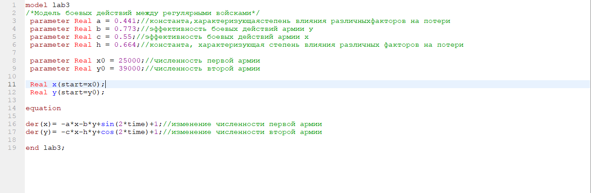
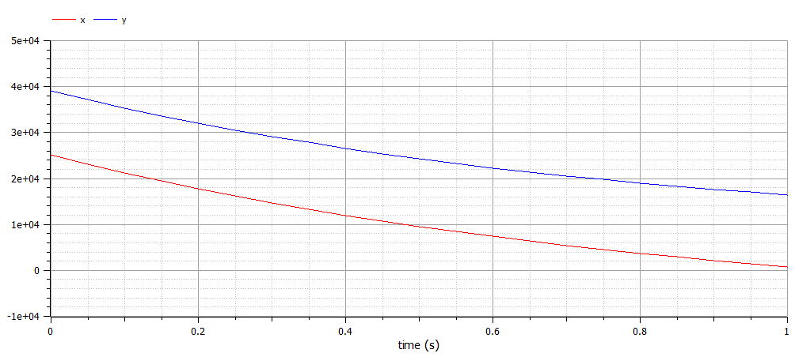
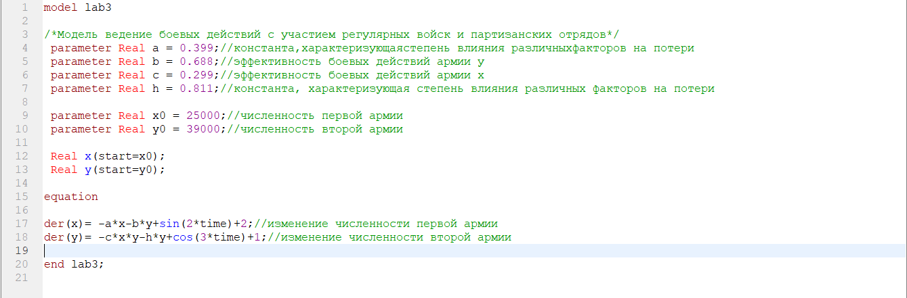
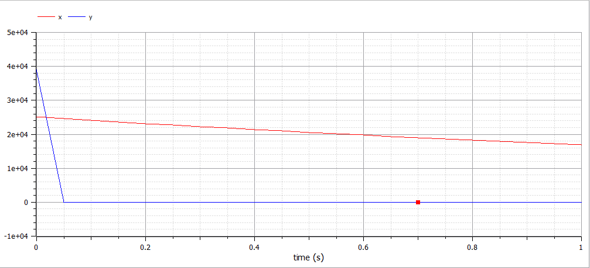

---
# Front matter
lang: ru-RU
title: "Лабораторная работа №3"
subtitle: "Модель боевых действий"
author: "Азарцова Полина Валерьевна"

# Formatting
toc-title: "Содержание"
toc: true # Table of contents
toc_depth: 2
lof: true # List of figures
lot: true # List of tables
fontsize: 12pt
linestretch: 1.5
papersize: a4paper
documentclass: scrreprt
polyglossia-lang: russian
polyglossia-otherlangs: english
mainfont: PT Serif
romanfont: PT Serif
sansfont: PT Sans
monofont: PT Mono
mainfontoptions: Ligatures=TeX
romanfontoptions: Ligatures=TeX
sansfontoptions: Ligatures=TeX,Scale=MatchLowercase
monofontoptions: Scale=MatchLowercase
indent: true
pdf-engine: lualatex
header-includes:
  - \linepenalty=10 # the penalty added to the badness of each line within a paragraph (no associated penalty node) Increasing the value makes tex try to have fewer lines in the paragraph.
  - \interlinepenalty=0 # value of the penalty (node) added after each line of a paragraph.
  - \hyphenpenalty=50 # the penalty for line breaking at an automatically inserted hyphen
  - \exhyphenpenalty=50 # the penalty for line breaking at an explicit hyphen
  - \binoppenalty=700 # the penalty for breaking a line at a binary operator
  - \relpenalty=500 # the penalty for breaking a line at a relation
  - \clubpenalty=150 # extra penalty for breaking after first line of a paragraph
  - \widowpenalty=150 # extra penalty for breaking before last line of a paragraph
  - \displaywidowpenalty=50 # extra penalty for breaking before last line before a display math
  - \brokenpenalty=100 # extra penalty for page breaking after a hyphenated line
  - \predisplaypenalty=10000 # penalty for breaking before a display
  - \postdisplaypenalty=0 # penalty for breaking after a display
  - \floatingpenalty = 20000 # penalty for splitting an insertion (can only be split footnote in standard LaTeX)
  - \raggedbottom # or \flushbottom
  - \usepackage{float} # keep figures where there are in the text
  - \floatplacement{figure}{H} # keep figures where there are in the text
---

# Цель работы

Изучение и построение одной из простейших моделей ведения боевых действий, модели Ланчестера, с помощью языка программирования Modelica. 

# Задание

1. Построить график изменения численности войск армии Х и армии У для случая ведения боевых действий между регулярными войсками.
2. Построить график изменения численности войск армии Х и армии У для случая ведения боевых действий с участием регулярных войск и партизанских отрядов.

# Выполнение лабораторной работы

Известны начальная численность войска X = 25000 человек и численность войска Y = 39000 человек.  
Коэффициенты степени влияния различных факторов для войск X и Y в первом случае - a = 0.441 и h = 0.664 и во втором случае - a = 0.399 и h = 0.811 .  
Коэффициенты эффективности боевых действий для войск X и Y в первом случае - b = 0.773 и c = 0.55 и во втором случае - b = 0.688 и c = 0.299 .  
Функции подкрепления к войскам X и Y в первом случае p(t) = sin(2t) + 1 и q(t) = cos(2t) + 1 и во втором случае - p(t) = sin(2t) + 2 и q(t) = cos(3t) + 1 .  
  
1. Рассмотрим модель боевых действий для двух регулярных армий:
$$\frac{dx}{dt}=-0,441x(t)-0,773y(t)+sin(2t)+1 $$
$$\frac{dy}{dt}=-0,55x(t)-0,664y(t)+cos(2t)+1 $$
Ниже представлен скриншот кода программы для первого случая на языке программирования Modelica. (рис 1. -@fig:001)  

{ #fig:001 width=70% }  

Также ниже представле график для первого случая. (рис 2. -@fig:001)  

{ #fig:001 width=70% }    

2. Рассмотрим модель ведения боевых действий с участием регулярной и партизанской армий:
$$\frac{dx}{dt}=-0,399x(t)-0,688y(t)+sin(2t)+2 $$
$$\frac{dy}{dt}=-0,299x(t)y(t)-0,811y(t)+cos(3t)+1 $$
Ниже представлен скриншот кода программы для второго случая на языке программирования Modelica. (рис 3. -@fig:001) 

{ #fig:001 width=70% }  

Также ниже представле график для второго случая. (рис 4. -@fig:001)  

{ #fig:001 width=70% }  

# Выводы

Научилась строить модель Ланчестера для ведения боевых действий.